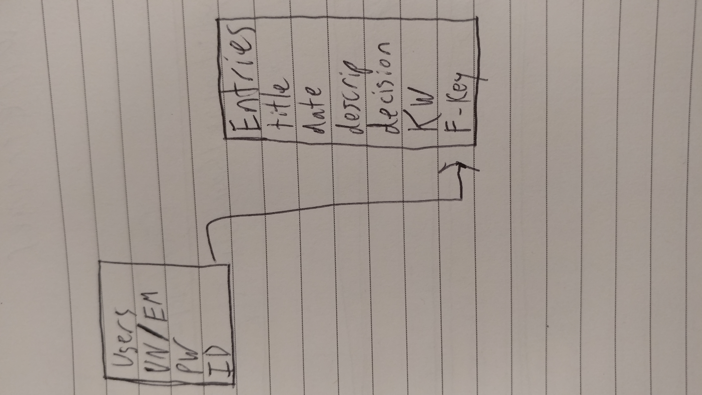

# SEI-Project-4-The-Cases-Diary
A personal legal cases journal.

Deployment: https://cases-diary-frontend.herokuapp.com/home

### Description 

This Project is a professional journal for lawyers. It allows them to create entries for cases that they have had in the past or currently. Within the journal they can organize their cases by date, keyword, decision, and title as well as search for cases by the same criteria.

### Wireframes

### User Stories

A user will be able to create an account and then access it through the app. The User will be able to add, edit, and delete entries as desired. Users will be able to search through their list of cases through the search function or organize there lsit of entries by any of the given catagories (Title, Date, Keywords, Decription, and Decision).

### Technologies

Python
React
SQL
Postges
React Router
Peewee
Semantic UI React
React Hooks

### Data Relationships

Users Can interface with their entries database.

### Unsolved Problems and Future Features

User functionality
Search functionality
List organization 
User sharing
Document upload
Chat
